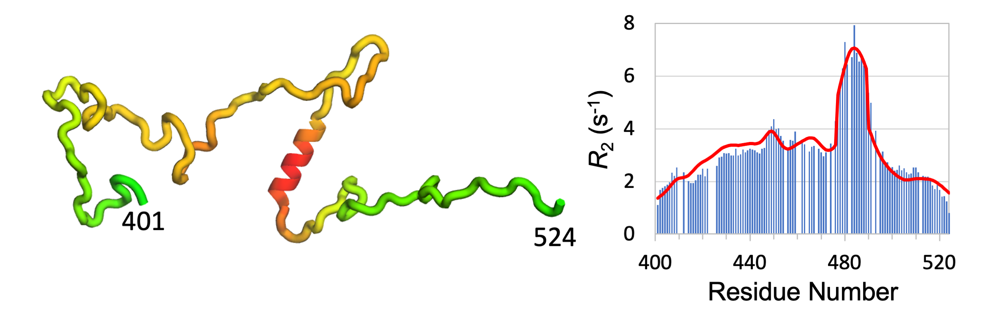

<head>
  <meta charset="UTF-8">
  <link rel="stylesheet" href="css/styles.css">
</head>
<body>

# DIRseq: a method for predicting drug-interacting residues of intrinsically disordered proteins from sequences

{width=45%}

## Method at a Glance

DIRseq is a sequence-based method for predicting drug-interacting residues of an intrinsically disordered protein. For a central residue <em>n</em>, every other residue <em>i</em> contributes a multiplicative factor <em>f(i; n)</em>, which depends on the amino-acid type of residue <em>i</em> and the sequence distance |<em>i-n</em>|. The total factor of residue <em>n</em> is then converted to a propensity score via a sigmoid function.

#### Reference:
* M. MacAinsih, S. Qin, and H.-X. Zhou (2025). DIRseq: a method for predicting drug-interacting residues of intrinsically disordered proteins from sequences, to be published.

#### Download source code
You can download the javascript code, DIRseq.js, for DIRseq [here](js/DIRseq.js). To run, use the following command,

        nodejs DIRseq.js PROTEINSEQENCE

where "PROTEINSEQENCE" is the protein sequence in one-letter representation. 

## Prediction

#### Enter the IDP (or IDR) sequence to get predicted drug-interacting residues propensity

<form name="dirseq">
* Type a name for referencing your submission:

> <input name="submitter" size="20" type="text">

* Paste the amino-acid sequence (in one-letter code; space and digits will be skipped):

> <textarea cols="80" name="userInput"></textarea>

* Paste params as array ([b,s1,s2]):

> <textarea cols="80" name="userParams">[0.3,1.5,14.0]</textarea> 

> <input onclick="predict()" type="button" value="Predict!">
<input type="reset" value="Clear Entries">
<input onclick="FillForm('dirseq')" type="button" value="Input Example">

</form>

### Output

> Name: <code class="eq_disp" id="protein_name"> </code>

> Seqence: <code class="eq_disp" id="protein_seq"> </code>

#### Data
1st column, amino acid; 2nd column, predicted *R*2 (in s-1)  
[*Note: a uniform scaling factor may be required to get best match with measured results.*]

<textarea id="textArea" style="position: relative; height:40vh; width:80vw"></textarea>

 
<button id="save" type="button" value="save"> Save data </button>

#### Figure

<canvas id="myChart"></canvas>

</body> 
