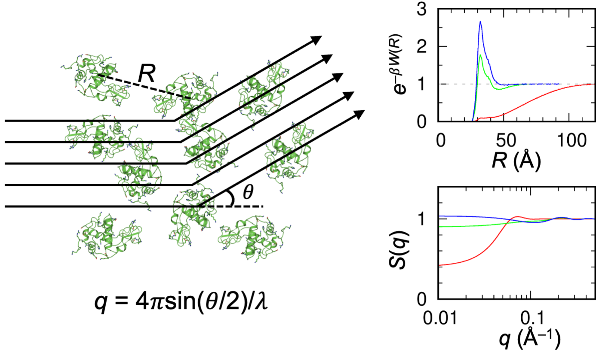

<head>
  <meta charset="UTF-8">
  <link rel="stylesheet" href="css/styles.css">
</head>
<body>

# FMAPS(q): Calculating Structure Factors of Protein Solutions by Atomistic Modeling of Protein-Protein Interactions

## Method at a Glance

FMAPS(q), for calculating the structure factor, of a protein
solution, by extending our fast Fourier transform-based modeling of atomistic protein-protein
interactions (FMAP) approach.

It takes the W(r) profile and volume-excluded diameter as input to produce the structure factors, S(q), at targeted concentration, bridged via percus-yevick approximation.

The FMAPB2 that provide the input info could access from web server at https://pipe.rcc.fsu.edu/fmapb2/ or a standalone version at https://github.com/zhougroup-uic/fmapb2. The javascript for FMAPS(q) to run in commadline are also aivalble at https://github.com/zhougroup-uic/fmapsq. 

#### Reference:
* S. Qin and H.-X. Zhou, Calculating Structure Factors of Protein Solutions by Atomistic Modeling of Protein-Protein Interactions, in submission.

## Prediction

#### upload the W(r) profile

<form name="fmapsq">
* Upload the gr.txt file from FMAPB2

> <input type="file" id="file-input"/>

* The volume-excluded diameter [*Note: the vaule could obtain from parms.txt *]

> <input name="simga" size="20" type="number"/>

* The molarity of Protein Solutions

> <input name="mol" size="20" type="number" value=0.002 /> mol/l

* Or the Molecular Weight and concentration

> <input name="molWght" size="20" type="number"/> Da <input name="concent" size="20" type="number"/> mg/ml

* start of q, interval of q, Number of q

> <input name="qstart" size="20" type="number" value=0.001 /> <input name="qstep" size="20" type="number" value=0.001 /> <input name="qnum" size="20" type="number" value=2000 />

> <input onclick="predict()" type="button" value="Predict!">
<input type="reset" value="Clear Entries">
<input onclick="FillForm('fmasq')" type="button" value="Input Example">

</form>
### Output

> simga: <code class="eq_disp" id="protein_sigma"> </code>

> molarity: <code class="eq_disp" id="protein_mol"> </code>

#### Data
1st column, q; 2nd column, FMAPSq;

<textarea id="textArea" style="position: relative; height:40vh; width:80vw"></textarea>

 
<button id="save" type="button" value="save"> Save data </button>

#### Figure

<canvas id="myChart"></canvas>

