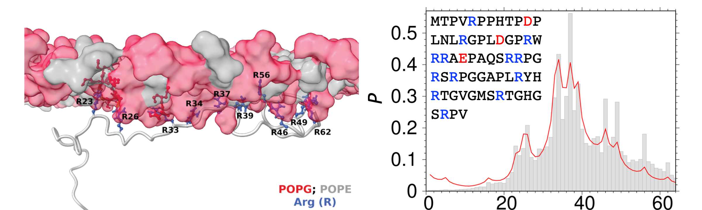

<head>
  <meta charset="UTF-8">
  <link rel="stylesheet" href="css/styles.css">
</head>
<body>

# R2T2NMR: For NMR Transverse Relaxation

{width=80%}

## Method at a Glance

ReSMAP is a sequence-based method for predicting the <u> Re </u> sidue-
<u> S </u> pecific <u> M </u> embrane- <u> A </u> ssociation <u> P </u>
ropensities of intrinsically disordered proteins. The prediction is made
from a sequence-based partition function. Every residue <i> i </i>
contributes a multiplicative Boltzmann factor <i> q </i>  <i> i;
</i> \| <i> i - n </i> \|  to the statistical weight for residue
<i> n </i> 's membrane association. <i> q </i>  <i> i; </i> \| <i>
i - n </i> \|  depends on the amino-acid type of residue <i> i
</i> and the sequence distance \| <i> i -- n </i> \|. We only
distinguish three types of amino acids: positively charged (K, R, and
the N-terminus), negatively charged (D, E, and the C-terminus), and
neutral (all other amino acids). The parameters of the partition
function were optimized against data from molecular dynamics simulations
of disordered proteins associating with acidic membranes. The images
above illustrate the ChiZ protein associated with a POPG:POPE membrane
(left), and the agreement between ReSMAP prediction and tthe molecular
dynamics simulation data for membrane-association propensity ( <i> P
</i> ) (right).

#### Reference:
* Qin, S.; Hicks, A.; Dey, S.; Prasad, R.; Zhou, H.-X. ReSMAP: Web Server for Predicting Residue-Specific Membrane-Association Propensities of Intrinsically Disordered Proteins. Membranes 2022, 12, 773. https://doi.org/10.3390/membranes12080773 [pdf](membranes-12-00773.pdf) [Supplementary Information](membranes-1839967-supplementary.pdf)

## Prediction

#### Enter the IDP (or IDR) sequence to get predicted transverse relaxation rate

<form name="resmapidp">
* Type a name for referencing your submission:

> <input name="submitter" size="20" type="text">

* Paste the amino-acid sequence (in one-letter code, ok with space and digits):

> <textarea cols="80" name="userInput"></textarea>

* Is there an amphipathic helix stably bound to  membrane? ( <i>Proteins with amphipathic helix have a different set of parameters.</i> )
 
> <input checked="checked" id="helix_no" name="helix" type="radio" value="No">
<label for="helix_no">No</label>
 
<input id="helix_yes" name="helix" type="radio" value="Yes">
<label for="helix_yes">Yes</label>

> <input onclick="predict()" type="button" value="Predict!">
<input type="reset" value="Clear Entries">
<input onclick="FillForm('resmapidp')" type="button" value="Input Example">

</form>

### Output

> Name: <code class="eq_disp" id="protein_name"> </code>

> Seqence: <code class="eq_disp" id="protein_seq"> </code>

> Amphipathic helix: <code class="eq_disp" id="protein_helix"> </code>
 
#### Data
1st column, amino acid; 2nd column, predicted rate

<textarea id="textArea" style="position: relative; height:40vh; width:80vw"></textarea>

 
<button id="save" type="button" value="save"> Save data </button>

#### Figure

<canvas id="myChart"></canvas>

 
<button id="btn-download"> Download figure </button>

</body> 
